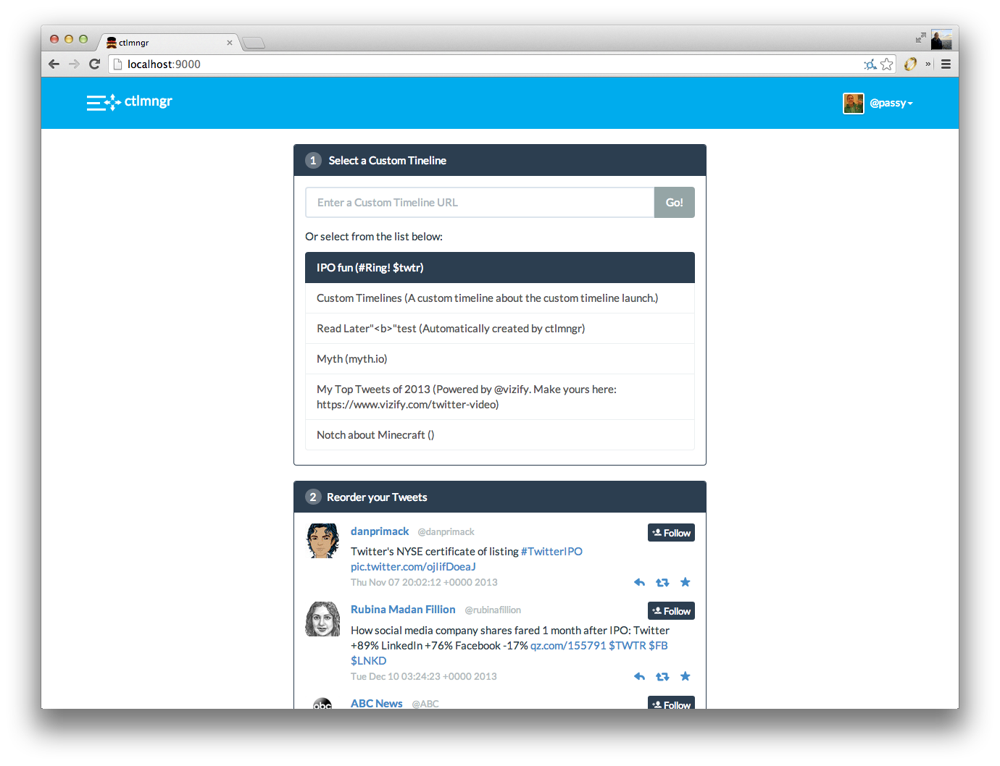

ctlmngr
=======

A manager for Custom Timelines and excuse to play around with Assetgraph and
React.



**This is not officially supported or endorsed by Twitter. This is just me
having fun.**

Setup
-----

**Dev**

```
npm install & bower install
grunt serve
```

**Build**
```
grunt build
```

**API Proxy**

You also need an API proxy. Why not use [twoxpy](http://github.com/passy/twoxpy)
(in fact, I require a very specific URL schema, so everything else probably
won't work without adjusting stuff)? By default it should listen on port 5000.

```bash
git clone https://github.com/passy/twoxpy
cd twoxpy
virtualenv .ve
. .ve/bin/activate
pip install -r requirements.txt
pip install honcho
$EDITOR .env # Set up API keys and stuff
honcho start
```
