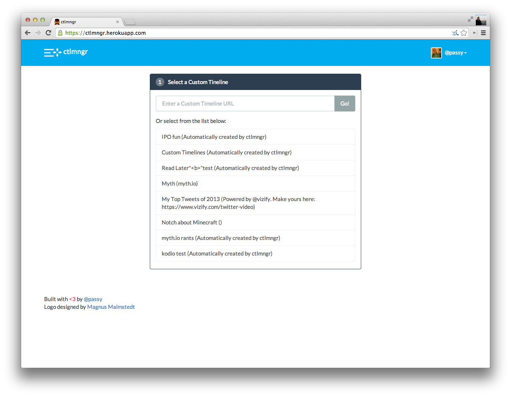
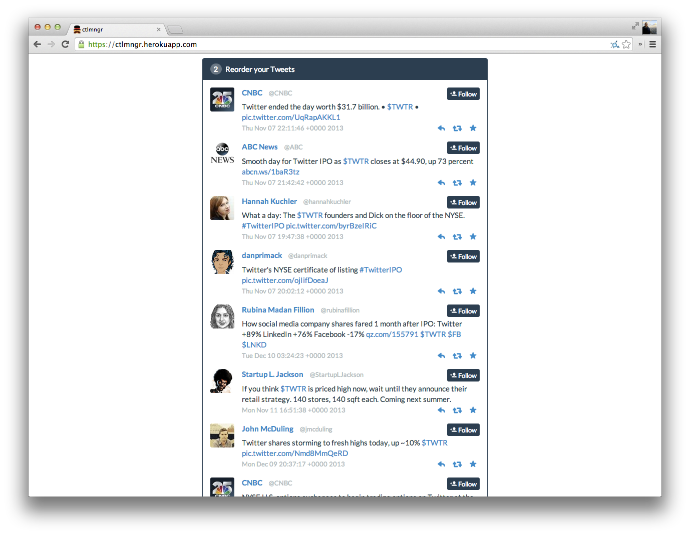
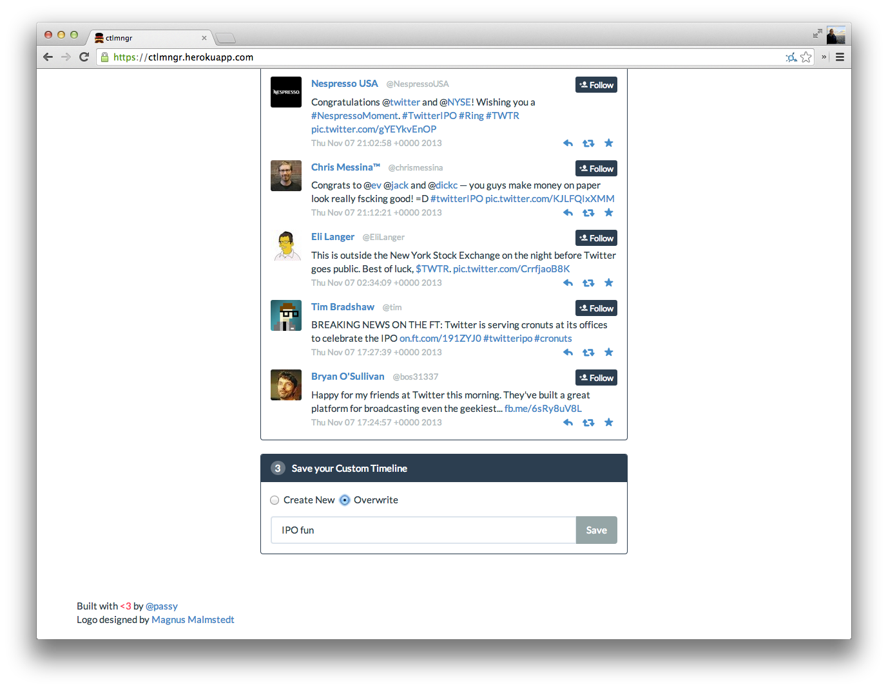

ctlmngr
=======

A manager for Custom Timelines and excuse to play around with Assetgraph and
React.





**This is not officially supported or endorsed by Twitter. This is just me
having fun.**

Demo
----

[See it in action on YouTube](https://www.youtube.com/watch?v=aqwPdoHNHhU)

There is a demo at
[https://ctlmngr.herokuapp.com](https://ctlmngr.herokuapp.com). Until the CTL
API is public, you have to be whitelisted in order to log in. Sorry.

Setup
-----

**Dev**

```
npm install & bower install
grunt serve
```

**Build**
*[(currently broken)](https://github.com/passy/ctlmngr/issues/19)*
```
grunt build
```

**API Proxy**

You also need an API proxy. Why not use
[twoxpy](http://github.com/passy/twoxpy)? (In fact, I require a very specific
URL schema, so everything else probably won't work without adjusting stuff)? By
default it should listen on port 5000. If you have the API set up somewhere
else, you need to adjust `app/scripts/config.json`.

```bash
git clone https://github.com/passy/twoxpy
cd twoxpy
virtualenv .ve
. .ve/bin/activate
pip install -r requirements.txt
pip install honcho
$EDITOR .env # Set up API keys and stuff
honcho start
```
